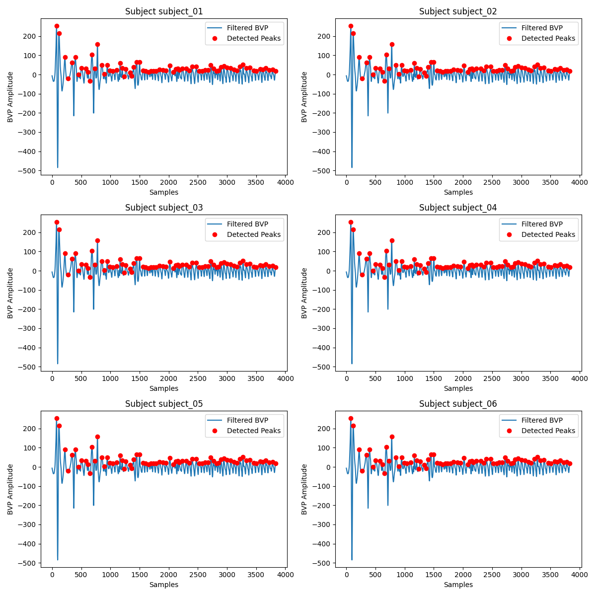

# Stress Detection from PPG/BVP Signals

Machine learning pipeline that classifies a person's stress state (**Stress** / **No Stress**) from Photoplethysmogram (PPG) / Blood Volume Pulse (BVP) signals, with a Flask web interface for real-time predictions.

## Overview

This project implements an end-to-end pipeline — from raw BVP signal preprocessing through feature extraction, model training, and a web app for live predictions. Several classification models were trained and compared, with the best-performing model deployed via a simple web interface.

## Dataset

The dataset consists of BVP/PPG signal recordings collected from multiple subjects during stress-inducing tasks and rest periods. Each recording was segmented into windows and used to extract time-domain, frequency-domain, and spectral-domain features for binary stress classification (Stress / No Stress).

## Project Structurestress-detection-ppg/

├── app.py                  # Flask web app for real-time stress prediction

├── preprocess.py            # Cleans and prepares raw BVP signal data

├── feature_extraction.py    # Extracts time, frequency, and spectral domain features

├── train_scaler.py          # Fits and saves the feature scaler used at inference time

├── model_training.py        # Trains and evaluates classification models

├── best_stress_model.pkl    # Saved best-performing trained model (Random Forest)

├── bvp_combined_plot.png     # Visualization of BVP signal data

├── static/                   # CSS, JS, and other static assets for the web app

└── templates/                # HTML templates for the web app

## Methodology

1. **Preprocessing** (`preprocess.py`) — cleans raw BVP signals and prepares them for feature extraction.
2. **Feature Extraction** (`feature_extraction.py`) — extracts time-domain, frequency-domain, and spectral-domain features from the BVP signal.
3. **Scaling** (`train_scaler.py`) — fits a scaler on the extracted features for normalization, saved for reuse at inference time.
4. **Model Training** (`model_training.py`) — trains and evaluates multiple classification models on a 70/30 train-test split.

## Results

| Model               | Accuracy |
|---------------------|----------|
| Random Forest       | 0.99     |
| Logistic Regression | 0.98     |
| KNN                  | 0.97     |
| SVM                  | 0.97     |

Random Forest achieved the highest accuracy and was saved as `best_stress_model.pkl` for deployment.



## Web Application

The Flask app (`app.py`) takes BVP-derived features as input and outputs a prediction of **Stress** or **No Stress** using the trained Random Forest model.

### Running locally

```bash
pip install -r requirements.txt
python app.py
```

Then open `http://localhost:5000` in your browser.

## Future Improvements

- Validate results with a subject-wise train/test split to better measure generalization to new individuals.
- Expand to multi-class stress levels (e.g., low/medium/high) rather than binary classification.
- Add live signal input support (e.g., from a wearable device).
